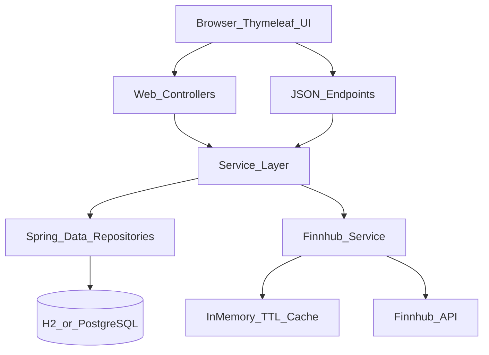
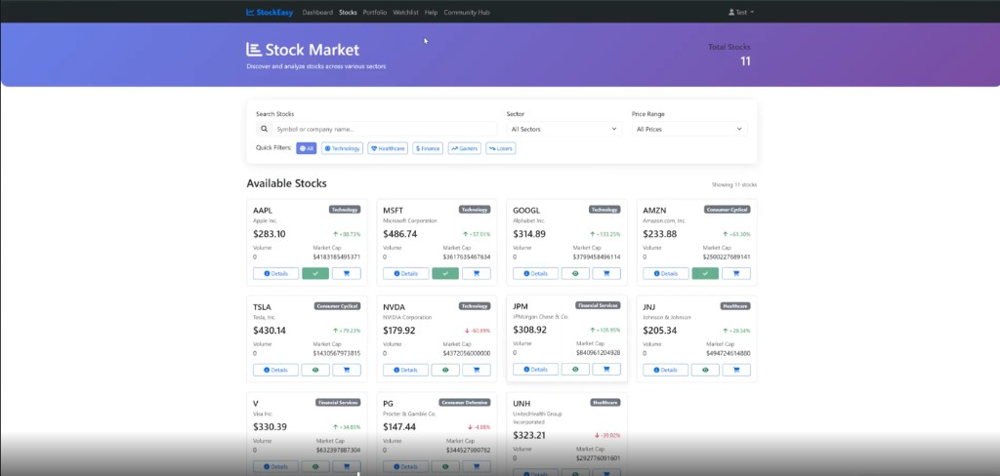
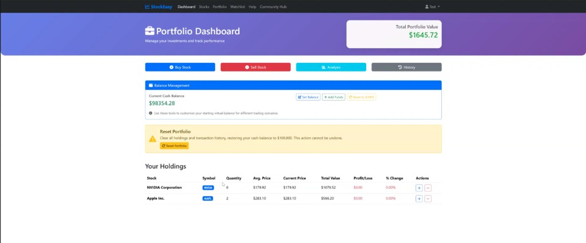
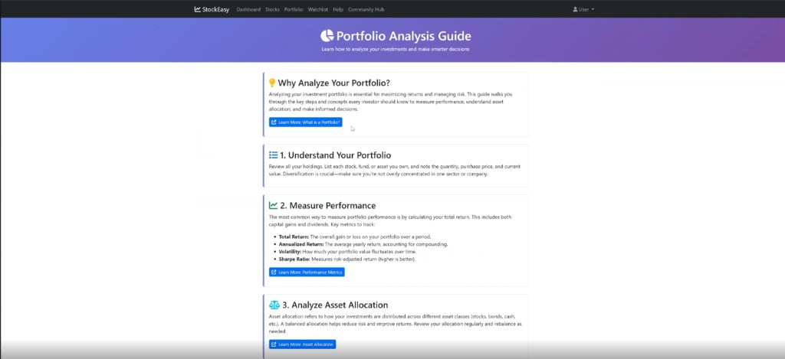
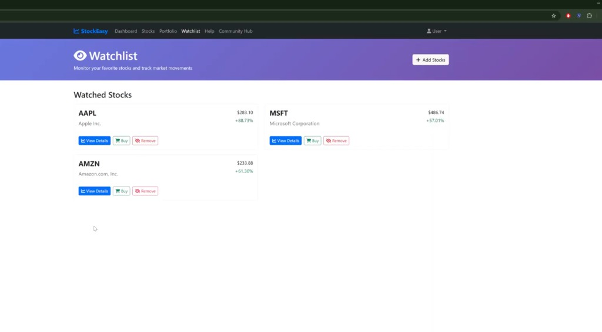
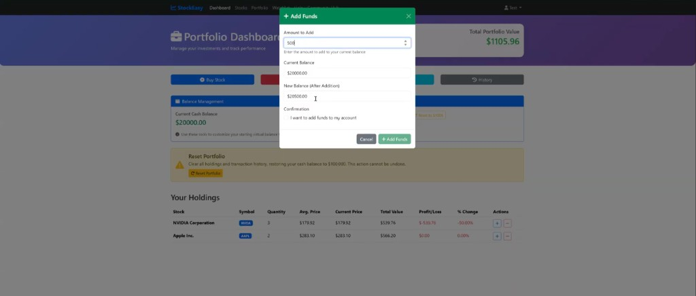

<div align="center">

# StockEasy
### Stock Trading Simulator Portfolio Project

[](https://openjdk.java.net/)
[](https://spring.io/projects/spring-boot)
[](https://www.postgresql.org/)
[](https://getbootstrap.com/)

Full-stack stock trading simulator with secure authentication, transaction processing, portfolio analytics, watchlists, and Finnhub-backed market data.

[Overview](#overview) • [Architecture](#architecture) • [Domain Model](#domain-model) • [API Surface](#api-surface) • [Quick Start](#quick-start) • [Demo Video](#demo-video)

</div>

---

## Overview

`StockEasy` is a Java 21 + Spring Boot application that simulates equity trading with virtual cash. It combines server-rendered MVC pages with JSON endpoints to support both traditional page flows and AJAX interactions.

Core capabilities include:
- stock discovery with filtering/search and detail pages
- buy/sell transaction execution with portfolio state updates
- holdings valuation and transaction history
- watchlist management and community feed interactions
- external market data ingestion with caching and retry/rate-limit behavior

This project originated as a multi-sprint software engineering course submission and was refined into a portfolio-ready repository.

## Tech Stack

| Layer | Technologies |
|---|---|
| Runtime | Java 21, Spring Boot 3.5 |
| Web | Spring MVC, Thymeleaf, Bootstrap 5 |
| Security | Spring Security, BCrypt password encoding |
| Data Access | Spring Data JPA, Hibernate |
| Datastores | H2 (dev/test), PostgreSQL (prod profile) |
| External Integration | Finnhub API via WebClient (WebFlux client) |
| API Docs | springdoc OpenAPI / Swagger UI |
| Testing | JUnit 5, Mockito, Spring Boot Test |

## Architecture



### Controller Layer

- `DashboardController`: home and market views
- `StockController`: stock listing/detail/filter + market data APIs
- `PortfolioController`: dashboard, buy/sell, history, analysis, AJAX buy
- `WatchlistController`: watchlist CRUD and alert toggles
- `CommunityController`: community feed read/create
- `AuthController`: login/register flows
- `ResetController`: portfolio reset/validate APIs
- `UserController`: balance management endpoints

### Service Layer Highlights

- `TransactionService`
  - `@Transactional` buy/sell orchestration
  - updates cash balance, transaction records, and portfolio holdings atomically
- `PortfolioService`
  - portfolio valuation and P/L calculations
  - weighted average purchase price updates
- `MarketDataService` + `FinnhubService`
  - quote/intraday/profile retrieval
  - fallback data behavior when external calls fail
  - retries and global call pacing
- `CacheService`
  - in-memory `ConcurrentHashMap` TTL cache to reduce API pressure
- `PortfolioResetService`
  - reset-to-baseline workflow for demo/testing scenarios

## Domain Model

Key JPA entities and relationships:

| Entity | Purpose | Important Mappings |
|---|---|---|
| `User` | authentication, profile, cash balance, roles | one-to-many `Portfolio`, `Watchlist`, `Transaction`; `UserDetails` implementation |
| `Stock` | symbol/company/sector/pricing metadata | one-to-many market/portfolio/watchlist references |
| `Portfolio` | per-user holdings snapshot | unique `(user_id, stock_id)`, current value + P/L fields |
| `Transaction` | trade ledger base type | single-table inheritance with `BuyTransaction`/`SellTransaction` |
| `Watchlist` | tracked symbols + optional alerts | unique `(user_id, stock_id)` |
| `MarketData` | time-series price snapshots | stock-linked historical and latest price records |
| `Post` | community feed item | username/content/timestamp |

## Trading Execution Flow

1. Authenticated user submits buy/sell intent (`/portfolio/*` or JSON API)
2. Service layer validates user, stock, quantity, and funds/shares
3. `TransactionService` persists `BuyTransaction`/`SellTransaction`
4. Cash balance and portfolio rows are updated in the same transactional boundary
5. UI reloads dashboard/history with updated holdings and P/L

## API Surface

Representative endpoints (web + JSON):

| Area | Endpoint | Method | Purpose |
|---|---|---|---|
| Stocks | `/stocks` | GET | list/filter active stocks |
| Stocks | `/stocks/{stockId}` | GET | stock detail page |
| Market Data | `/stocks/api/latest/{symbol}` | GET | latest quote payload |
| Market Data | `/stocks/api/intraday/{symbol}` | GET | intraday data series |
| Market Data | `/stocks/api/refresh/{symbol}` | POST | refresh symbol data |
| Portfolio | `/portfolio/dashboard` | GET | holdings dashboard |
| Portfolio | `/portfolio/buy` | POST | form-based buy execution |
| Portfolio | `/portfolio/api/buy` | POST | JSON/AJAX buy flow |
| Portfolio | `/portfolio/sell` | POST | sell execution |
| Portfolio | `/portfolio/history` | GET | trade history page |
| Reset | `/reset/portfolio` | POST | reset portfolio to baseline state |
| Watchlist | `/watchlist` | GET | watchlist page |
| Watchlist | `/watchlist/api/add` | POST | AJAX add-to-watchlist |
| Community | `/community` | GET/POST | feed retrieval and post creation |
| User Balance | `/users/{userId}/balance/*` | POST/GET | set/add/reset/get balance |

Interactive API docs: [http://localhost:8080/swagger-ui.html](http://localhost:8080/swagger-ui.html)

## Security Model

- Spring Security with custom login page and session-based auth
- `User` implements `UserDetails`; role values mapped to Spring authorities
- password hashing through BCrypt encoder
- route policy:
  - public: `/`, auth pages, help, stock browsing
  - authenticated: dashboard/portfolio/watchlist and user operations
- note: CSRF is currently disabled in `SecurityConfig` for demo simplicity

## Configuration Profiles

`application.yml` defines profile-driven runtime behavior:

| Profile | Database | Intended Use |
|---|---|---|
| `dev` | H2 in-memory (`create-drop`) | local development/demo |
| `test` | H2 in-memory | automated test execution |
| `prod` | PostgreSQL via env vars | deployment-like runs |

Required env vars for production-style setup:

- `SPRING_PROFILES_ACTIVE=prod`
- `DB_HOST`, `DB_PORT`, `DB_NAME`, `DB_USER`, `DB_PASSWORD`
- `FINNHUB_API_KEY`

## Quick Start

### Prerequisites

- Java 21
- Maven 3.9+

### Run

```bash
git clone https://github.com/<your-github-username>/StockEasy-Portfolio.git
cd StockEasy-Portfolio
mvn spring-boot:run
```

Open:
- app: `http://localhost:8080`
- swagger: `http://localhost:8080/swagger-ui.html`

### Demo Account

- Username: `testuser`
- Password: `password`

Seed data is initialized at startup for users, stocks, and community posts.

## Demo Video

<div align="center">
  <a href="https://drive.google.com/file/d/1oIJ7vFI1ICYzKsyNSGsxgcGAFt7KjuQm/view" target="_blank">
    
  </a>
</div>

Portfolio demo link: [Open the StockEasy demo video](https://drive.google.com/file/d/1oIJ7vFI1ICYzKsyNSGsxgcGAFt7KjuQm/view)

## Screenshots

<p align="center">
  
  
</p>

<p align="center">
  
  
</p>

<p align="center">
  
</p>

## Agile Workflow

Delivery followed a Scrum-style cadence with Trello as the planning/tracking backbone: backlog grooming, sprint-scoped user stories, acceptance criteria, progress tracking across workflow states, and standup-driven blocker management.

## Documentation

- Sprint and process artifacts: [`doc/`](./doc/)
- Sprint planning and release process notes: [`doc/sprint1/RPM.md`](./doc/sprint1/RPM.md)
- Sprint execution/retrospective notes: [`doc/sprint2/SR2.md`](./doc/sprint2/SR2.md), [`doc/sprint3/SR2.md`](./doc/sprint3/SR2.md)
- System design materials: [`doc/system_design/`](./doc/system_design/)

## Notes

- This is a simulation project. No real trading or brokerage integration is involved.
- The repository preserves selected course documentation for process transparency and design traceability.
