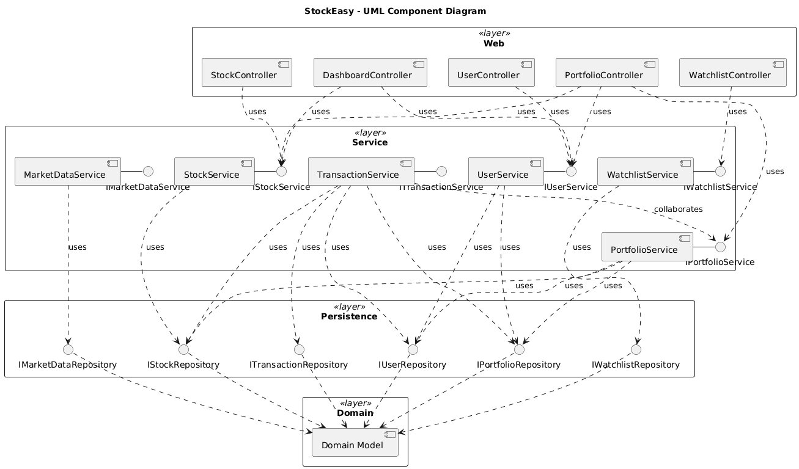

# Table of Contents

1. CRC Cards
2. Environment and Assumptions
3. Architecture (Overview + Diagram)
4. System Decomposition (Class/Package mapping)
5. Error and Exception Strategy

# 1) CRC Cards

## Web (Controllers)

### DashboardController
- **Responsibilities:** Handle home/dashboard requests; assemble summary metrics (user snapshot, watchlist highlights, market tickers); return Thymeleaf view and/or JSON.
- **Collaborators:** StockService, UserService

### PortfolioController
- **Responsibilities:** Serve portfolio pages and JSON; add/remove holdings; expose portfolio value, composition, and history endpoints.
- **Collaborators:** PortfolioService, UserService, StockService
- **Notes:** Buy/Sell flow may delegate via PortfolioService and/or TransactionService (to be finalized in Sprint 2).

### StockController
- **Responsibilities:** List stocks; show stock details; filter by sector/industry; return views or JSON.
- **Collaborators:** StockService

### UserController
- **Responsibilities:** Registration and profile endpoints; profile JSON/views.
- **Collaborators:** UserService
- **Notes:** Authentication UI uses Spring Security’s default login page (no custom security yet).

### WatchlistController
- **Responsibilities:** CRUD for user watchlists; add/remove symbols; list watchlist contents with current price snapshot when needed.
- **Collaborators:** WatchlistService, UserService, StockService

---

## Service Layer

### MarketDataService
- **Responsibilities:** Provide current (or cached) quotes and optional historical snapshots; handle timeouts/fallbacks when a provider is added.
- **Collaborators:** MarketDataRepository, StockService

### PortfolioService
- **Responsibilities:** Portfolio valuation; positions aggregation; derived metrics (P/L, sector breakdown); reconcile portfolio after transactions.
- **Collaborators:** PortfolioRepository, TransactionRepository, StockRepository, MarketDataService, UserRepository

### StockService

- **Responsibilities:** Stock lookup, list, search/filter; enrich lists/details with latest price where appropriate.
- **Collaborators:** StockRepository, MarketDataService

### TransactionService

- **Responsibilities:** Execute buy/sell with validation (sufficient balance/holdings); persist transactions; define transactional boundaries and rollbacks.
- **Collaborators:** TransactionRepository, PortfolioRepository, StockRepository, UserRepository, PortfolioService

### UserService
- **Responsibilities:** User registration and profile updates; user lookup.
- **Collaborators:** UserRepository

### WatchlistService
- **Responsibilities:** Manage watchlists; idempotent add/remove; list symbols with optional current price snapshot.
- **Collaborators:** WatchlistRepository, StockRepository, UserRepository, MarketDataService

---

## Persistence (Repositories)
- **UserRepository** — CRUD + finders for `User`.  
    **Collaborators:** UserService
- **PortfolioRepository** — CRUD + queries for `Portfolio` (e.g., by user).  
    **Collaborators:** PortfolioService
- **StockRepository** — CRUD + search/filter for `Stock`.  
    **Collaborators:** StockService
- **TransactionRepository** — CRUD + history queries (e.g., user transaction history with `JOIN FETCH stock`).  
    **Collaborators:** TransactionService, PortfolioService
- **WatchlistRepository** — CRUD + membership queries for `Watchlist`.  
    **Collaborators:** WatchlistService
- **MarketDataRepository** — Persist/lookup `MarketData` snapshots if stored.  
    **Collaborators:** MarketDataService

---

## Domain (Entities)

- **User** — Identity/profile of account owner.  
    **Collaborators:** Portfolio, Transaction, Watchlist
- **Portfolio** — Aggregate of positions/holdings for a user.  
    **Collaborators:** User, Stock, Transaction
- **Stock** — Symbol, name, sector/industry metadata.  
    **Collaborators:** MarketData, Transaction, Watchlist, Portfolio
- **Transaction** _(buy/sell captured via a type field or subclasses as implemented)_ — Executed trade with price/qty/timestamp.  
    **Collaborators:** User, Stock, Portfolio
- **Watchlist** — Set of user-tracked symbols.  
    **Collaborators:** User, Stock
- **MarketData** — Price snapshots/series with timestamps.  
    **Collaborators:** Stock

---

# 2) Environment and Assumptions (Interaction with the environment)

## Runtime and Tooling
- **Java (JDK):** 21
- **Build:** Maven 3.9+
- **Spring Boot:** 3.3.0
- **Application Port:** 8080 (HTTP)

## Databases
- **Primary (dev):** PostgreSQL **14+** (local instance or container; final approach not determined)
    - **Connection:** Provided via `application-dev.properties` / environment variables
    - **Database name / credentials:** team-defined; do **not** commit secrets.
    - **Rationale:** Data (users, portfolios, transactions, watchlists, stocks/metadata, optional market data) should persist across app restarts.
- **Tests / quick local runs:** H2 (in-memory or file) under the `test` profile for fast feedback.
- **Schema migrations:** none yet (no Flyway/Liquibase in Sprint 1).

## Spring Profiles and Config
- **Profiles:**
    - `dev` → PostgreSQL 14+
    - `test` → H2
- **Activation:** `SPRING_PROFILES_ACTIVE=dev|test` or `-Dspring-boot.run.profiles=dev|test`.
- **Secrets/config:** supplied via environment variables or untracked local config; keep credentials out of VCS.

## OS and Tooling Assumptions
- **OS:** Windows/macOS/Linux (developer choice).
- **Containerization:** PostgreSQL may be run natively or via Docker (not determined); both approaches acceptable.
- **Frontend:** Server-rendered Thymeleaf; Node/npm not required in Sprint 1.

## Web and Network
- **Inbound:** HTTP on `localhost:8080`.
- **Outbound:** No external services required in Sprint 1; market-data integration is not determined yet (stub/cached values acceptable for this sprint).
- **CORS/CSRF:** Spring Security defaults.

## Security
- **Auth:** Spring Security default login page; no custom configuration in Sprint 1.
- **Authorization:** default role model (if any) or open endpoints per controller mappings (to be hardened in later sprints).

# 3) Architecture

At a high level, the app uses a layered MVC design. Controllers translate HTTP requests into service calls and then return a view (Thymeleaf) or JSON. Services hold the business rules (buy/sell logic, portfolio valuation, watchlists) and act as the gateway to data. Repositories handle persistence via Spring Data JPA. Domain entities (User, Portfolio, Stock, Transaction, Watchlist, MarketData) define the key data structures that capture the core concepts of the application.

# 4) System Decomposition

### Packages → Roles
- `com.example.stockeasy.web` → Controllers (serve views/JSON; thin)
- `com.example.stockeasy.service` → Business logic (`MarketDataService`, `PortfolioService`, `StockService`, `TransactionService`, `UserService`, `WatchlistService`)
- `com.example.stockeasy.repo` → Repositories (`*Repository`) with derived queries and targeted JPQL
- `com.example.stockeasy.domain` → Entities and relationships (`User`, `Stock`, `Portfolio`, `Transaction` (+ buy/sell), `Watchlist`, `MarketData`)  
### Notable mappings/examples
- `PortfolioController` → `PortfolioService` (+ `UserService`, `StockService`)
- `TransactionService` → `TransactionRepository`, `UserRepository`, `StockRepository`, `PortfolioRepository` (+ `PortfolioService`)

# 5) Errors and Exception Strategy

We handle errors in three places. 
- First, in the controllers we validate inputs (Bean Validation) and show clear messages in the form or JSON. 
- Second, the services check business rules and throw small custom exceptions with messages the user can act on. 
- Lastly, if the database or the market-data service has issues, the app doesn’t crash. We either show cached data or a basic error page and keep things running. Our APIs return the same JSON fields for errors, we add a request ID to logs to trace problems, and any failed write is rolled back so we don’t leave half-saved data.

### Anticipated cases and response:

|Scenario|Where detected|Response to user|Retry / Fallback|
|---|---|---|---|
|Invalid input (missing/invalid fields)|Controller / Bean Validation|**400**; re-render form with field errors, or JSON `{status, error, message, fieldErrors}`|No retry; user fixes input|
|Authentication failure|Auth layer / UserService|**401**; redirect to login with message; JSON error envelope|No retry; optional lockout after repeats|
|Authorization denied|Security filter / Controller|**403**; access-denied page or JSON error|No retry|
|Resource not found (User/Stock/Portfolio/Watchlist)|Service / Repository|**404**; not-found page or JSON with hint|No retry|
|Business rule violation (e.g., selling more than owned, not enough funds)|Service|**409** or **422**; show actionable message (available qty/balance)|No retry; user adjusts request|
|Database error (connectivity/timeout, constraint)|Repository / JPA|**503** (connectivity) with `Retry-After`, or **409** (constraint)|Small automatic retry for timeouts; otherwise try again later|
|External market-data failure/timeout|MarketDataService|**200** with cached “last known” data and a “data delayed” banner; APIs set `stale=true`|Short retry with backoff; fall back to cache|

