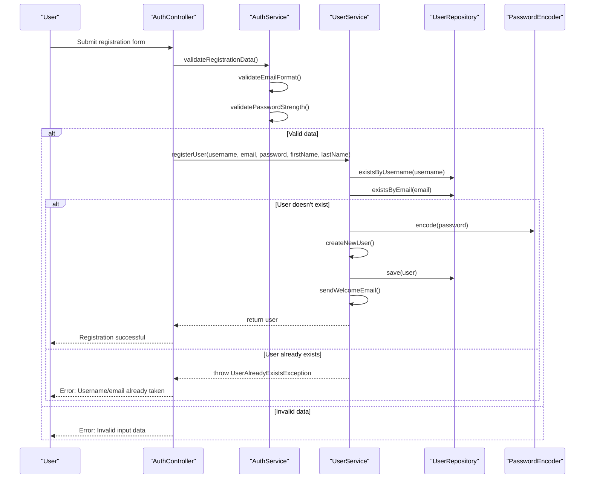
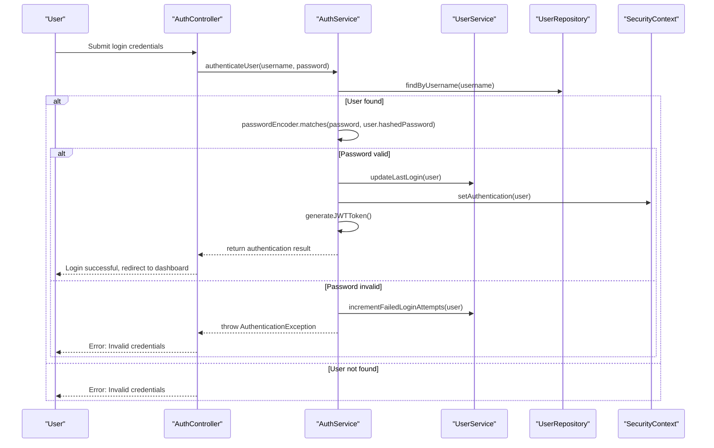
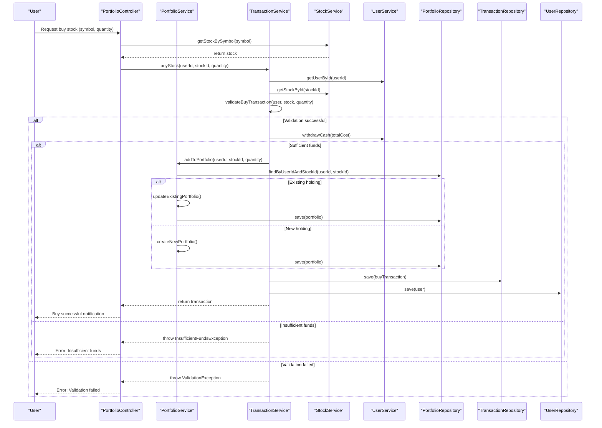
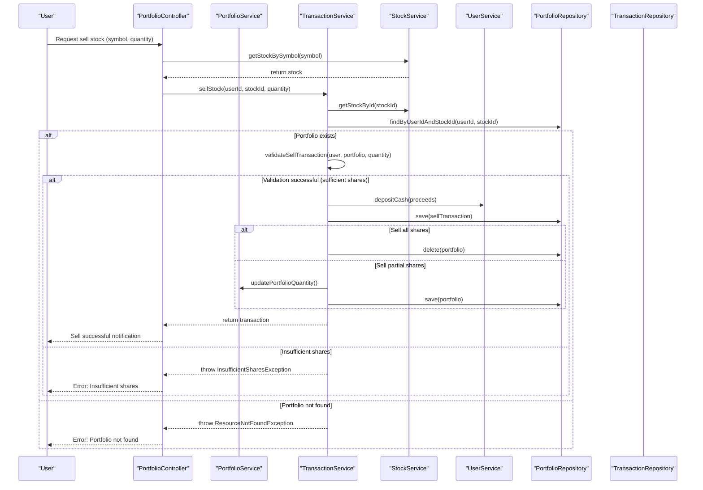
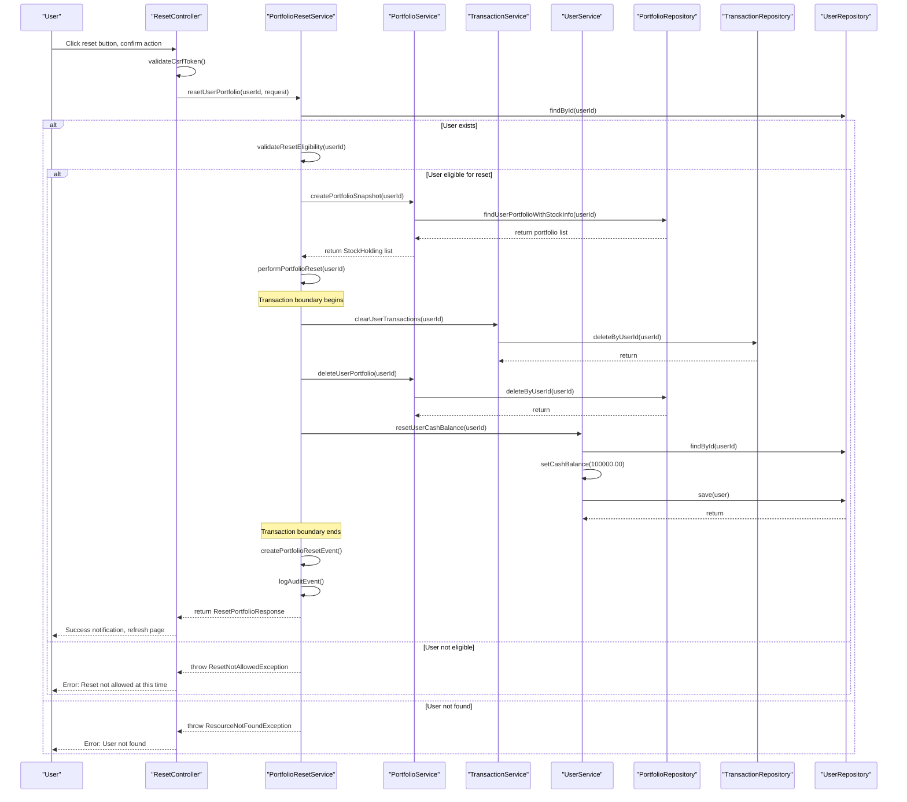
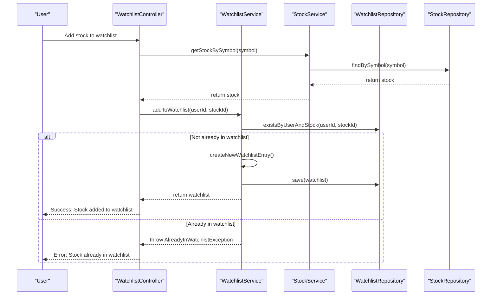
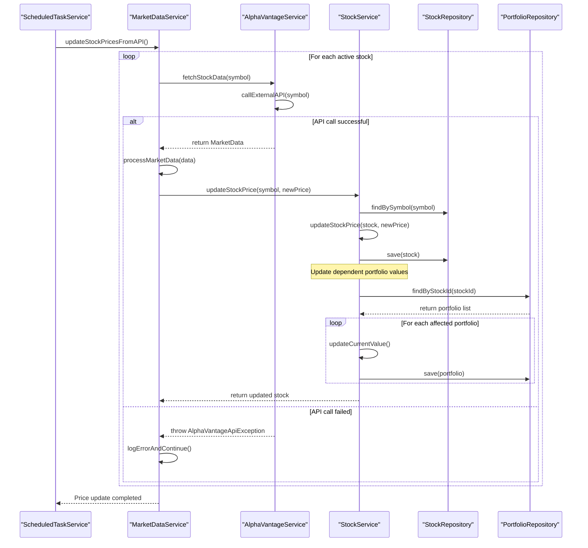

# StockEasy System - UML Sequence Diagrams

This document provides UML sequence diagrams for key workflows in the StockEasy stock trading simulator system.

## System Overview

The sequence diagrams illustrate the flow of interactions between system components for critical business processes including user authentication, stock trading, portfolio management, and the new portfolio reset functionality.

## 1. User Registration Sequence



## 2. User Login Sequence



## 3. Buy Stock Transaction Sequence



## 4. Sell Stock Transaction Sequence



## 5. Portfolio Reset Sequence (New Feature)



## 6. Portfolio Dashboard Load Sequence

```mermaid
sequenceDiagram
    participant User as "User"
    participant PortfolioController as "PortfolioController"
    participant PortfolioService as "PortfolioService"
    participant TransactionService as "TransactionService"
    participant StockService as "StockService"
    participant UserService as "UserService"
    participant PortfolioRepository as "PortfolioRepository"
    participant TransactionRepository as "TransactionRepository"

    User->>PortfolioController: Navigate to portfolio dashboard
    PortfolioController->>UserService: getCurrentUser()
    
    par Load portfolio data
        PortfolioController->>PortfolioService: getUserPortfolio(userId)
        PortfolioService->>PortfolioRepository: findUserPortfolioWithStockInfo(userId)
        PortfolioRepository-->>PortfolioService: return portfolio list
        PortfolioService->>PortfolioService: updateCurrentValue() for each portfolio
        PortfolioService->>PortfolioRepository: save() each updated portfolio
        PortfolioService-->>PortfolioController: return portfolio items
    and Load portfolio value
        PortfolioController->>PortfolioService: calculatePortfolioValue(userId)
        PortfolioService->>PortfolioRepository: calculatePortfolioValue(userId)
        PortfolioRepository-->>PortfolioService: return total value
        PortfolioService-->>PortfolioController: return portfolio value
    and Load available stocks
        PortfolioController->>StockService: getActiveStocks()
        StockService->>StockRepository: findByActiveTrue()
        StockRepository-->>StockService: return active stocks
        StockService-->>PortfolioController: return stock list
    and Load recent transactions
        PortfolioController->>TransactionService: getUserTransactionHistory(userId)
        TransactionService->>TransactionRepository: findUserTransactionHistory(userId)
        TransactionRepository-->>TransactionService: return transaction list
        TransactionService-->>PortfolioController: return transaction history
    and Load user profile
        PortfolioController->>UserService: getUserProfile(userId)
        UserService->>UserRepository: findByIdWithRelationships(userId)
        UserRepository-->>UserService: return user with data
        UserService-->>PortfolioController: return user profile
    
    PortfolioController->>PortfolioController: aggregateAllData()
    PortfolioController-->>User: Display portfolio dashboard with all data
```

## 7. Watchlist Management Sequence



## 8. Market Data Update Sequence



## Key Sequence Flow Patterns

### 1. Request Validation Pattern
All user requests follow this pattern:
1. **Input Validation**: Controllers validate input format
2. **Business Validation**: Services validate business rules
3. **Authorization Check**: Security context validation
4. **Data Access**: Repository operations within transactions
5. **Response Formatting**: Controllers format responses

### 2. Transaction Management Pattern
Critical operations use this pattern:
1. **Transaction Begin**: @Transactional annotation
2. **Multiple Operations**: Portfolio, Transaction, User updates
3. **Error Handling**: Rollback on exceptions
4. **Audit Logging**: Post-commit audit events

### 3. Error Handling Pattern
All sequences include comprehensive error handling:
- **Validation Errors**: Input format and business rule violations
- **Business Errors**: Insufficient funds, shares, permissions
- **System Errors**: Database failures, API timeouts
- **User Feedback**: Appropriate error messages and recovery options

### 4. Security Pattern
Security is enforced throughout:
- **Authentication**: User identity verification
- **Authorization**: Permission checks for operations
- **CSRF Protection**: Token validation for state-changing operations
- **Audit Logging**: Security event tracking

These sequence diagrams provide a comprehensive view of the system's dynamic behavior, showing how components interact to deliver the StockEasy functionality.
